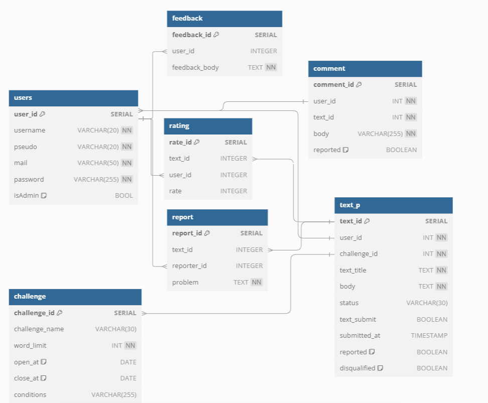

# Writivity

## Description
Writivity is an innovative platform designed to foster creativity through writing challenges. Users can participate in various writing contests, submit their texts, and engage with a community of writers. The platform allows users to create challenges, manage submissions, and interact with other writers.

## Features
- **User  Registration and Login**: 
  - Users can create accounts and log in to access their profiles and submitted texts.
  - If a user does not have an account, they can click the Register button to navigate to the sign-up page.

- **Homepage**: 
  - Displays ongoing challenges on the left side and closed challenges on the right, allowing users to navigate easily.

- **Challenge Management**: 
  - Users can create new challenges by filling out a form that includes the challenge name, prerequisites, and word limit.
  - Users can view details of existing challenges, including name, description, conditions, word limits, and submission deadlines.

- **Profile Management**: 
  - Users can manage their profiles, view their submissions and their statuses, and send feedback to the Writivity Team.

- **Text Submission**: 
  - Users can submit their written texts for challenges, requiring a title and the body of the text.

- **Community Engagement**: 
  - Users can comment on and rate submitted texts, fostering interaction within the community.
  - Users can report inappropriate content if necessary.

- **Admin Features**: 
  - Admin users can manage user accounts, oversee challenges and submissions, and handle reported content and user disputes.

## Project Architecture

### 1. Project Structure
The Writivity project is structured to separate concerns, making it easier to manage and develop. The main components include:
- **Controllers**: Handle incoming requests, process user input, and return responses.
- **Models**: Represent the data structure of the application, including entities like Users, Challenges, Texts, Comments, etc.
- **Repositories**: Interface with the database to perform CRUD (Create, Read, Update, Delete) operations on the models.
- **Templates**: HTML files that define the user interface, using Thymeleaf for dynamic content rendering.
- **Static Resources**: CSS and JavaScript files that enhance the user interface and experience.

### 2. Key Components and Their Connections
- **Controllers**: Manage user interactions and data flow between the models and views.
  - **BaseController**: Manages the home page and redirects users based on their login status.
  - **LoginController**: Handles user login and registration.
  - **ChallengeController**: Manages challenge-related actions.
  - **TextController**: Handles text submissions and ratings.

- **Models**: Represent the core data entities.
  - **Users**: Represents user data and their submissions.
  - **Challenge**: Represents writing challenges.
  - **Text**: Represents submitted texts.
  - **Comment**: Represents comments on texts.
  - **Rate**: Represents ratings given to texts.

- **Repositories**: Provide methods to interact with the database for each model.

### 3. Database Interaction
- The project uses JPA (Java Persistence API) to interact with the database, with each model mapped to a corresponding database table.
- Repositories extend `JpaRepository`, providing built-in methods for common database operations.

### 4. Database Structure
The Writivity project utilizes a relational database to store its data. The main tables include:

- **Users Table**: 
  - Stores user information such as `id`, `username`, `email`, and `password`.
  - Each user can have multiple submissions associated with them.

- **Challenges Table**: 
  - Contains details about each writing challenge, including `id`, `name`, `description`, `conditions`, `word_limit`, `start_date`, and `end_date`.
  - Each challenge can have multiple texts submitted by different users.

- **Texts Table**: 
  - Stores submitted texts with attributes like `id`, `title`, `body`, `submission_date`, and `status`.
  - Each text is linked to a specific user and a challenge.

- **Comments Table**: 
  - Contains comments made by users on submitted texts, with fields such as `id`, `text_id`, `user_id`, and `content`.

- **Rates Table**: 
  - Stores ratings given to texts, including `id`, `text_id`, `user_id`, and `rating_value`.

This relational structure allows for efficient querying and management of data, ensuring that users can easily access and interact with challenges and submissions.

### 5. User Interaction Flow
1. **User  Registration/Login**: Users register or log in through the `LoginController`.
2. **Homepage Navigation**: Upon successful login, users are redirected to the homepage managed by `BaseController`.
3. **Challenge Participation**: Users can click on a challenge to view details, managed by `ChallengeController`.
4. **Text Submission**: Users submit texts for challenges through the `TextController`.
5. **Community Engagement**: Users can comment on and rate texts.

### 6. Frontend Interaction
- The frontend is built using Thymeleaf templates, which dynamically render content based on the data provided by the controllers.
- Static resources (CSS, images) enhance the user interface.

## Installation Instructions
To set up the Writivity project locally, follow these steps:

1. **Clone the repository**.
2. **Install dependencies**: Ensure you have Maven installed.
3. **Link a Database**: We use Docker to store our database using PostgreSQL. Create a database named "writivity" and add the access info in `application.properties`.
4. **Run the application**.
5. **Access the application**: Open your web browser and navigate to `http://localhost:8080`.

## Usage
- **User  Registration**: Navigate to the signup page to create a new account.
- **Login**: Use your credentials to log in and access your profile.
- **Participate in Challenges**: View available challenges on the homepage and click to participate.
- **Submit Texts**: Fill out the submission form for the challenge you are participating in.
